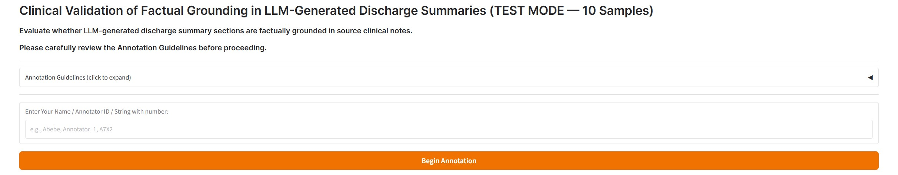

# Clinical Validation Study

Materials for the human evaluation: 100 generated discharge summaries rated by four annotators (three medical students and one senior postdoctoral clinician at a collaborating university hospital).

MIMIC-IV-derived content is not included, in line with the PhysioNet Data Use Agreement.

## Interface preview



## Evalution preview


## Files

| File | Purpose |
|------|---------|
| [`guidelines.txt`](guidelines.txt) | Full annotation guidelines shown to annotators |
| [`rubric.md`](rubric.md) | The 8 evaluation fields at a glance |
| [`sample_sheet_schema.md`](sample_sheet_schema.md) | CSV column specification |
| [`ui/app.py`](ui/app.py) | Gradio annotation interface |
| [`ui/requirements.txt`](ui/requirements.txt) | Python dependencies |
| [`compute_agreement.py`](compute_agreement.py) | Fleiss' kappa, Cohen's kappa, ICC, and Spearman correlation script |

## How to run

Launch the interface locally:
```bash
cd ui && pip install -r requirements.txt && python app.py
```

Compute inter-annotator agreement once all annotators submit their CSVs:
```bash
python compute_agreement.py
```

See the *Human/Clinical Validation* section of the paper for the full methodology.
